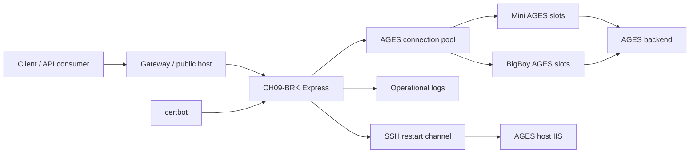

# CH09-BRK SSD - AGES Broker Source of Truth

Estado: baseline generado desde implementación existente  
Fecha: 2026-06-22  
Proyecto: `habitat/CH09-BRK`  
Paquete: `se_broker`  
Responsabilidad: broker stateful para llamadas AGES con pool de sesiones, trazabilidad, recuperación y operación Docker.

> Este documento pasa a ser la fuente de verdad funcional y operativa de CH09-BRK. Si el código, Postman, deploy scripts o documentación externa difieren de este SSD, se debe actualizar el artefacto correspondiente o abrir una decisión explícita.

## 1. Resumen ejecutivo

CH09-BRK es un servicio Node.js/Express en TypeScript que actúa como broker entre clientes externos y AGES. No es un proxy stateless: mantiene un pool de sesiones AGES precalentadas, separa llamadas `mini` y `bigb`, agrega headers de trazabilidad, registra tiempos operativos, recicla slots con problemas y puede reiniciar IIS remoto cuando AGES entra en estados recuperables por restart.

La superficie pública prevista del servicio es:

- Servicio broker: `https://api.solinges.com.ar/foreign/broker`
- Atajo AGES: `https://nages.solinges.com.ar/ages/`
- Local default: `http://localhost:41048`

Situación observada al momento de este baseline: `api.solinges.com.ar` existe y `/foreign/broker` está documentado como destino previsto, pero no estaba confirmado en el nginx actual de `nages`; `/ages/` sí estaba documentado como publicado en `nages.solinges.com.ar`.

## 2. Fuentes analizadas

| Área | Fuente |
| --- | --- |
| Runtime | `src/app.ts`, `src/routes/rou_broker.ts`, `src/services/ages_pool.ts`, `src/models/mod_credentials.ts`, `src/utils/logger.ts` |
| API docs | `postman/CH09-BRK.openapi.json`, `postman/CH09-BRK.postman_collection.json`, `postman/CH09-BRK.local.postman_environment.json` |
| Config local | `package.json`, `tsconfig.json`, `default.env`, `docker-compose.yml`, `Dockerfile`, `docker-entrypoint.sh` |
| Deploy | `.deploy-*`, `.deploy-ge01/*`, `.update-merclin-ssl.ps1`, `sol_ecosystem/dockerzone/habitat/CH09-BRK` |
| Ecosystem | `ECOSISTEMA_APIS_NODE_POSTMAN.md`, `ECOSISTEMA_ELEMENTOS_CONFIGURACION.md` |
| Operación/performance | `Tests/delay/*` |

## 3. Alcance funcional

### 3.1 Incluido

- Exponer rutas broker bajo `/foreign/broker`.
- Exponer atajo AGES bajo `/ages`.
- Proxyear funciones AGES `mini` y `bigb`.
- Mantener pool de sesiones AGES con warmup, adquisición, liberación, crecimiento adaptativo y reciclado.
- Incluir trazabilidad por request mediante headers `X-CH09-BRK-*`.
- Mostrar estado operativo del pool y timing log.
- Ejecutar warmup manual.
- Reciclar slots manualmente.
- Reiniciar IIS remoto por SSH cuando sea necesario.
- Servir challenge HTTP-01 para certbot.
- Ejecutar en Docker con volúmenes externos para config, logs, certificados y clave pública SSH.

### 3.2 Fuera de alcance

- Reemplazar AGES.
- Implementar lógica de negocio AGES dentro de CH09-BRK.
- Persistir una base propia como requisito principal del flujo broker.
- Exponer valores secretos en documentación, HTML operativo o logs públicos.
- Considerar el README actual como fuente suficiente de comportamiento.

## 4. Arquitectura



| Componente | Responsabilidad |
| --- | --- |
| `src/app.ts` | Bootstrap Express, HTTP/HTTPS, CORS, raw body para proxy, montaje de rutas, ACME webroot, warmup inicial y ping monitor. |
| `src/routes/rou_broker.ts` | Router HTTP, endpoints operativos/admin, proxy AGES, dashboards HTML, headers de respuesta. |
| `src/services/ages_pool.ts` | Estado del pool, warmup, adquisición/liberación, trazas, métricas, reciclado, crecimiento adaptativo, restart IIS por SSH. |
| `src/models/mod_credentials.ts` | Modelos de credentials/accounts/sessions vía `se_configbase`; no es parte central del runtime broker observado. |
| `src/utils/logger.ts` | Wrapper de logging y envío de debug mail mediante `AgesLog`. |

## 5. Contrato de rutas

El mismo `BrokerRouter` se monta bajo dos prefijos:

- `/foreign/broker`
- `/ages`

Esto significa que las rutas operativas pueden existir bajo ambos prefijos si no se filtran aguas arriba. El contrato público recomendado debe separar explícitamente qué se publica y qué queda interno/admin.

### 5.1 Rutas base y salud

| Método | Ruta documentada | Propósito |
| --- | --- | --- |
| GET | `/` | Identificación básica del servicio. |
| GET | `/foreign` | Ruta informativa documentada en Postman/OpenAPI. |
| GET | `/foreign/broker/` | Base pública del broker. |
| GET | `/foreign/broker/health` | Health check del broker. |
| GET | `/ages/health` | Health check por montaje `/ages`. |

### 5.2 Rutas operativas del pool

| Método | Ruta bajo `/foreign/broker` | Propósito |
| --- | --- | --- |
| GET | `/pool` | Resumen JSON del pool. |
| GET | `/pool/show` | Dashboard HTML del pool. |
| GET | `/pool/timings` | Timing log JSON. |
| GET | `/pool/timings/show` | Dashboard HTML de timing log. |
| POST | `/pool/timings/clear` | Limpia timing log. |
| POST | `/pool/warmup` | Ejecuta warmup manual. |
| POST | `/pool/slots/{slot}/recycle` | Recicla un slot por referencia. |

### 5.3 Rutas administrativas de IIS

| Método | Ruta bajo `/foreign/broker` | Propósito |
| --- | --- | --- |
| POST | `/ages-host/restart-iis` | Reinicia IIS del host AGES por SSH. |
| GET | `/ages-host/restart-iis` | Variante GET existente. Debe considerarse riesgosa. |
| POST | `/iis/restart` | Alias de restart IIS. |
| GET | `/iis/restart` | Variante GET existente. Debe considerarse riesgosa. |

Requisito de fuente de verdad: estas rutas son administrativas. Si se publican externamente, deben protegerse por autenticación/autorización y preferir `POST` sobre `GET` para acciones destructivas o disruptivas.

### 5.4 Rutas proxy AGES documentadas

| Método | Ruta | Tipo |
| --- | --- | --- |
| GET/POST | `/foreign/broker/ages/{agesFunction}` | BigBoy/documentado. |
| GET/POST | `/foreign/broker/ages/~mini~/{agesFunction}` | Mini/documentado. |
| GET/POST | `/ages/{agesFunction}` | Atajo AGES/documentado. |

### 5.5 Rutas proxy AGES observadas en código

El código usa rutas `all(...)`, no solo GET/POST. En la práctica puede aceptar más métodos HTTP para proxy.

| Patrón | Tipo | Comportamiento |
| --- | --- | --- |
| `/ages/~mini~/:agesFunction` | mini | Proxy directo a función mini. |
| `/ages/~mini~/*` | mini | Proxy REST multi-segmento mini. |
| `/ages/:agesFunction` | bigb | Proxy directo a función bigb. |
| `/ages/*` | bigb | Proxy REST multi-segmento bigb. |
| `/~mini~/:agesFunction` | mini | Variante mini sin prefijo `/ages`. |
| `/~mini~/*` | mini | Variante REST mini sin prefijo `/ages`. |
| `/:agesFunction` | bigb | Catch-all por función. |
| `/*` | bigb | Catch-all REST. |

Decisión pendiente: definir si todos los métodos aceptados por `all(...)` son contrato público o compatibilidad interna accidental. Hasta decidirlo, OpenAPI/Postman solo documentan GET/POST.

## 6. Contrato proxy

### 6.1 Request

- Para `/foreign/broker/ages` y `/ages`, el body se parsea como raw (`type: "*/*"`) antes de JSON global.
- Para otros endpoints, Express usa JSON global.
- El proxy conserva headers entrantes relevantes.
- Si el body no es buffer, se serializa como JSON.
- No se envía body hacia AGES en métodos `GET` o `HEAD`.
- `X-AGES-API-Key` puede usarse en warmup desde configuración; en proxy normal debe venir del cliente si AGES lo requiere.

### 6.2 Response

- Se replica el status code devuelto por AGES cuando hay respuesta AGES válida.
- Se filtran headers hop-by-hop antes de responder al cliente.
- Se agregan headers operativos:
  - `X-CH09-BRK-Pool-Slot`
  - `X-CH09-BRK-Pool-Kind`
  - `X-CH09-BRK-Trace-Id`
  - `X-CH09-BRK-AGES-Ms`
  - `X-CH09-BRK-Broker-Ms`
  - `X-CH09-BRK-Queue`
  - `X-CH09-BRK-Broker-Out`
  - `X-CH09-BRK-Total-Ms`

### 6.3 Errores

| Situación | Respuesta esperada |
| --- | --- |
| Pool todavía en warmup | HTTP 503, body `{ status: "warmup", message }`, header `Retry-After: 60`. |
| Error broker sin respuesta AGES válida | HTTP 502, body `{ status: "error", message }`. |
| AGES HTTP >= 500 | El broker puede marcar/reciclar el slot asociado. |
| Error de script o `dll_init_error` | Puede gatillar reciclado y/o restart IIS según política interna. |
| Respuesta AGES que contiene `OSAVFP no es un objeto` | El broker debe tratar la respuesta como slot dañado: no debe devolver esa respuesta al cliente, debe descartar el slot usado para ese intento, limpiar su `agesToken` para forzar su caída/reciclado, y reenviar el mismo pedido al próximo slot libre compatible. |

## 7. Modelo de pool

### 7.1 Tipos de slots

| Tipo | Uso |
| --- | --- |
| `mini` | Llamadas AGES mini, prefijos `~mini~`. |
| `bigb` | Llamadas AGES estándar/bigboy. |

### 7.2 Defaults

| Variable | Default | Descripción |
| --- | ---: | --- |
| `slots_mini` | 5 | Slots mini iniciales. |
| `slots_bigb` | 5 | Slots bigb iniciales. |
| `slots_mini_max` | 10 | Máximo mini con crecimiento adaptativo. |
| `slots_bigb_max` | 10 | Máximo bigb con crecimiento adaptativo. |
| `slots_adaptive_hold_minutes` | 30 | Tiempo de retención de slots dinámicos antes de achicar. |

### 7.3 Ciclo de vida de slot

Estados observados:

- `idle`
- `warming`
- `ready`
- `error`

Un slot se considera listo cuando logra warmup y obtiene credenciales/sesión AGES suficientes, incluyendo `AGES_TOKEN` y `ASP.NET_SessionId`.

### 7.4 Adquisición

Orden de adquisición:

1. Usar slot base libre.
2. Usar slot dinámico libre.
3. Crear slot dinámico si el tipo no alcanzó su máximo.
4. Si el pool todavía está calentando, usar cualquier slot del tipo requerido que ya esté `ready`; no se debe bloquear todo el tráfico esperando que termine el warmup completo.
5. Esperar en cola solo si no hay ningún slot compatible disponible.

Regla de disponibilidad parcial: el warmup del pool es incremental. Un slot `ready` queda habilitado para tráfico inmediatamente aunque otros slots sigan en `warming` o `error`.

Regla de descarte por objeto AVFP inválido: si una respuesta AGES contiene el texto `OSAVFP no es un objeto`, esa respuesta indica una sesión/slot corrupto, no un resultado válido de negocio. El broker debe liberar el request del slot dañado, excluir ese slot de nuevos pedidos hasta reciclarlo, borrar su `agesToken` como mecanismo explícito para hacerlo caer, y reintentar el pedido una sola vez por cada siguiente slot libre compatible hasta obtener respuesta válida o agotar disponibilidad/timeout.

Regla de warmup manual: cuando el operador presiona el botón `Warmup` o invoca `POST /pool/warmup`, el broker debe blanquear todos los slots existentes antes de iniciar el ciclo, igual que un arranque fresco. El blanqueo elimina tokens, cookies, respuestas previas, errores, endpoint/uso anterior y estado de uso; luego todos los slots pasan por `warming` y se van llenando incrementalmente.

Riesgo: la espera de slot debe tener timeout operativo definido. Si el código no lo aplica, el SSD exige documentarlo como deuda técnica.

### 7.5 Warmup y recuperación

- Warmup inicial al levantar HTTP.
- Warmup manual por botón/API: blanquea todos los slots antes de recalentar.
- El warmup no debe ser una barrera global: los slots que ya estén `ready` pueden atender requests mientras el resto del pool continúa calentando.
- Timeout de warmup por intento: 50 segundos.
- Máximo de intentos por warmup: 2.
- Ping monitor: cada 5 minutos.
- El ping monitor recicla slots no listos o con ping no exitoso.
- Slots dinámicos se pueden reducir luego del hold time configurado.
- Un slot descartado por `OSAVFP no es un objeto` debe entrar al circuito normal de reciclado después de limpiar `agesToken`; el pedido original debe continuar en otro slot libre antes de responder error al cliente.

## 8. Restart IIS remoto

CH09-BRK puede reiniciar IIS del host AGES por SSH.

### 8.1 Variables

| Variable | Propósito |
| --- | --- |
| `AGES_SSH_HOST` | Host del servidor AGES/IIS. Si falta, se deriva de `HAAGES`. |
| `AGES_SSH_USER` | Usuario SSH remoto. |
| `AGES_SSH_KEY_PATH` | Clave privada dentro del contenedor. Default `/app/keys/ch09_brk_iis`. |
| `AGES_SSH_RESTART_COMMAND` | Comando remoto. Default `powershell -NoProfile -ExecutionPolicy Bypass -Command "iisreset /restart"`. |
| `AGES_IIS_RESTART_COOLDOWN_SECONDS` | Cooldown entre reinicios. Default 300. |

### 8.2 Seguridad operativa

- El contenedor genera/exporta una clave pública en `/app/ssh-public/ch09_brk_iis.pub`.
- En Windows OpenSSH, si el usuario remoto es administrador, la clave debe ir en `C:\ProgramData\ssh\administrators_authorized_keys` con ACL correcta.
- Debe existir lock/cooldown para evitar restart storms.
- Las rutas de restart no deben quedar públicas sin protección.

## 9. Configuración

### 9.1 Puertos

| Concepto | Default |
| --- | ---: |
| App HTTP interna | `PORT=41048` |
| App HTTPS interna | `PORT_SSL=44048` |
| Docker host HTTP local | `HOST_PORT=41048` |
| Docker container HTTP | `CONTAINER_PORT=41048` |
| Docker host HTTPS local | `HOST_SSL_PORT=44048` |
| Docker container HTTPS | `CONTAINER_SSL_PORT=44048` |

Gotcha: el Dockerfile expone `3000 80 443`, pero la aplicación real escucha por `PORT` y `PORT_SSL`. La fuente de verdad de puertos es la configuración runtime/compose, no `EXPOSE`.

### 9.2 Variables principales

| Grupo | Variables |
| --- | --- |
| Core | `PORT`, `PORT_SSL`, `MSCODE`, `MSINSTANCE`, `MSDB`, `MSVERSION`, `MSMONINTERVAL`, `MSURL`, `MSSERVICETYPE` |
| AGES | `HAAGES`, `AGES_API_KEY`, `AGES_SSH_HOST`, `AGES_SSH_USER`, `AGES_SSH_KEY_PATH`, `AGES_SSH_RESTART_COMMAND`, `AGES_IIS_RESTART_COOLDOWN_SECONDS` |
| Pool | `slots_mini`, `slots_bigb`, `slots_mini_max`, `slots_bigb_max`, `slots_adaptive_hold_minutes` |
| SSL/certbot | `CERTBOT_DOMAIN`, `CERTBOT_EMAIL`, `SSL_CERT_DOMAIN`, `SSL_CERT_PATH`, `SSL_KEY_PATH`, `CERT_PATH_CONTAINER`, `CERTBOT_WEBROOT` |
| Paths | `CONFIG_PATH`, `LOG_PATH`, `CERT_PATH`, `CERTBOT_WEBROOT_PATH`, `SSH_PUBLIC_KEY_HOST_PATH`, `LOGDIR` |
| Behavior | `HIDE_404`, `ERROR_DEBUG_DETAILS` |
| Model bases | `MODELBASES_PALLETS`, `MODELBASES_PRODUCTS`, `MODELBASES_WAREHOUSES` |

No se deben copiar valores secretos desde `.env`, Postman environments o deploy folders a este documento.

## 10. Docker y despliegue

### 10.1 Build

Scripts observados:

```powershell
npm run tsc
npm run build
npm run build-push
```

La imagen `dhzacur/ha_ch09_brk` depende de `build/` ya generado. El Dockerfile no ejecuta `npm run tsc`; por lo tanto, el build TypeScript debe ocurrir antes de `docker build`.

### 10.2 Imagen

| Propiedad | Valor |
| --- | --- |
| Base | `node:22-alpine` |
| Runtime | `node build/app.js` |
| Imagen publicada | `dhzacur/ha_ch09_brk` |
| Herramientas adicionales | `git`, `openssh-client` |
| Entrypoint | `docker-entrypoint.sh` |

### 10.3 Volúmenes

| Host | Contenedor | Uso |
| --- | --- | --- |
| `${LOG_PATH}` | `/etc/nages2/logdir` | Logs. |
| `${CONFIG_PATH}/.env` | `/app/.env` | Config runtime. |
| `${CERT_PATH}` | `/app/certificados` | Certificados de la app. |
| `${SSH_PUBLIC_KEY_HOST_PATH}` | `/app/ssh-public` | Export de clave pública SSH. |
| `${CERTBOT_WEBROOT_PATH}` | `/app/certbot-www` | Webroot challenge HTTP-01. |

Certbot:

| Host | Contenedor | Uso |
| --- | --- | --- |
| `${CERT_PATH}` | `/etc/letsencrypt` | Certificados Let's Encrypt. |
| `${CERTBOT_WEBROOT_PATH}` | `/var/www/certbot` | Webroot certbot. |

### 10.4 Topologías soportadas

| Topología | Archivos | Notas |
| --- | --- | --- |
| Local/template repo | `docker-compose.yml`, `default.env` | Puertos 41048/44048. |
| Windows/Merclin-like | `sol_ecosystem/dockerzone/habitat/CH09-BRK` | Paths `C:\Servidor\Solinges\ecosystem\...`; AGES típico `http://server3/ages`; restart SSH a Windows. |
| Linux GE01 + storage Windows | `.deploy-ge01/*` | Monta `192.168.89.2:/C:/Servidor/Solinges` en `/mnt/solinges-phys` por SSHFS; publica 80/443 y 38000/38443. |

### 10.5 Certificados

- La app sirve `/.well-known/acme-challenge` desde `CERTBOT_WEBROOT`.
- Cert esperado por dominio:
  - `/app/certificados/live/{SSL_CERT_DOMAIN}/fullchain.pem`
  - `/app/certificados/live/{SSL_CERT_DOMAIN}/privkey.pem`
- Si falta dominio/cert/key, HTTP arranca y HTTPS no; el servicio debe loguear diagnóstico.
- HTTP-01 requiere que el dominio público llegue al host por puerto 80.

## 11. Observabilidad

### 11.1 Health y pool

- `/health` valida disponibilidad básica del broker.
- `/pool` expone resumen del pool.
- `/pool/show` expone dashboard HTML.
- `/pool/timings` expone timing log.
- `/pool/timings/show` expone dashboard HTML de tiempos.

### 11.2 Headers de trazabilidad

Los clientes y pruebas operativas deben usar los headers `X-CH09-BRK-*` para diagnosticar:

- slot usado,
- tipo de pool,
- trace id,
- tiempo AGES,
- tiempo broker,
- espera de cola,
- tiempo total.

### 11.3 Pruebas delay

`Tests/delay` contiene herramientas operativas para medir latencia/concurrencia contra el broker. Endpoint default observado:

```txt
/ages/~mini~/delay.ages
```

Parámetros relevantes:

- `delay`
- `count`
- `timeout`
- `sync`
- `endpoint`
- `server`

Estas pruebas son de operación/performance; no reemplazan tests unitarios ni integración formal.

## 12. Seguridad

### 12.1 Requisitos obligatorios

- No documentar ni versionar valores secretos.
- No exponer tokens AGES, cookies `ASP.NET_SessionId`, API keys, passwords ni previews sensibles en HTML o logs públicos.
- Proteger rutas administrativas (`/iis/restart`, `/ages-host/restart-iis`, reciclado de slots, warmup manual, limpieza de timings) antes de publicarlas.
- Preferir `POST` para acciones administrativas; `GET` para restart existe por compatibilidad observada, pero no debe ser el contrato recomendado.
- Definir explícitamente si `/foreign/broker` queda detrás de gateway con auth, IP allowlist, VPN o mecanismo equivalente.

### 12.2 Hallazgo crítico de baseline

El middleware `Doorman` se monta después de `/foreign/broker` y `/ages` en el bootstrap observado. Por orden de middleware Express, eso no protege esas rutas. Si se requiere autenticación, debe moverse antes o aplicarse sobre el router antes de montarlo.

Esto no es detalle cosmético: es seguridad de borde. Si el broker reinicia IIS y muestra sesiones, la autenticación no puede ser un deseo en documentación; tiene que estar en el pipeline real.

## 13. Riesgos y deudas técnicas

| Riesgo | Impacto | Acción recomendada |
| --- | --- | --- |
| Auth efectiva ausente por orden de middleware | Alto | Mover/aplicar auth antes de montar rutas públicas/admin. |
| Restart IIS expuesto por GET/POST | Alto | Restringir a POST autenticado/admin o red interna. |
| Pool dashboards pueden exponer tokens/sesiones | Alto | Sanitizar respuestas operativas. |
| `.env` y Postman environments pueden contener secretos | Alto | Mantener fuera de commits o usar placeholders. |
| Dockerfile no compila TypeScript | Medio | Documentar build previo o convertir a multi-stage build. |
| `EXPOSE` no coincide con puertos reales | Medio | Corregir Dockerfile o aclarar en deploy docs. |
| `waitForSlot` sin timeout operativo claro | Medio | Definir timeout y respuesta 503/429. |
| Warmup secuencial corta ante fallas | Medio | Evaluar warmup paralelo/parcial con reporte por slot. |
| `/foreign/broker` previsto pero no confirmado en nginx | Medio | Verificar/publicar ruta antes de darla como activa. |
| Inconsistencia posible `permission` vs `permissions` en modelo | Bajo/Medio | Auditar `mod_credentials.ts` si se usa ese modelo. |

## 14. Criterios de aceptación para recrear el proyecto desde cero

Una implementación nueva de CH09-BRK cumple este SSD cuando:

- [ ] Levanta HTTP en `PORT=41048` por default.
- [ ] Levanta HTTPS en `PORT_SSL=44048` cuando existen certificados válidos.
- [ ] Monta broker bajo `/foreign/broker`.
- [ ] Monta atajo AGES bajo `/ages` si se mantiene compatibilidad actual.
- [ ] Proxyea funciones AGES `mini` y `bigb` con body/headers correctos.
- [ ] Mantiene pool inicial `mini=5` y `bigb=5`, con máximos configurables.
- [ ] Ejecuta warmup inicial y permite usar slots `ready` aunque otros slots sigan calentando.
- [ ] Ejecuta warmup manual reseteando primero todos los slots existentes y luego rellenándolos incrementalmente.
- [ ] Agrega headers `X-CH09-BRK-*` a respuestas proxy.
- [ ] Registra timing log consultable y limpiable.
- [ ] Recicla slots con errores AGES críticos.
- [ ] Ante una respuesta con `OSAVFP no es un objeto`, descarta el slot, borra su `agesToken`, reintenta el mismo pedido en el próximo slot libre compatible y solo responde error si no queda slot válido disponible.
- [ ] Ejecuta ping monitor periódico.
- [ ] Implementa restart IIS por SSH con cooldown y lock.
- [ ] Protege rutas administrativas antes de publicación externa.
- [ ] Sanitiza tokens/cookies/sesiones en salidas operativas.
- [ ] Publica Docker image reproducible desde build TypeScript vigente.
- [ ] Monta config/log/certs/ssh-public/certbot-www como volúmenes externos.
- [ ] Incluye Postman/OpenAPI actualizado contra el contrato elegido.
- [ ] Incluye prueba operativa delay/concurrencia o equivalente.

## 15. Comandos de verificación

### 15.1 Local/Docker host

```bash
docker ps --filter name=ch09-brk --format "table {{.Names}}\t{{.Status}}\t{{.Ports}}"
curl -sS -m 8 http://127.0.0.1:41048/foreign/broker/health
curl -sS -m 8 http://127.0.0.1:41048/foreign/broker/pool
curl -sS -m 8 http://127.0.0.1:41048/foreign/broker/pool/timings
```

### 15.2 Expected pool shape

```json
{
  "size": 10,
  "ready": 10,
  "warming": 0,
  "error": 0
}
```

Los conteos esperados deben ajustarse si `slots_mini`, `slots_bigb` o los máximos cambian.

### 15.3 Build

```powershell
npm install
npm run tsc
npm run build
```

Para publicar:

```powershell
npm run build-push
```

## 16. Decisiones pendientes

- Definir si el contrato público acepta todos los métodos HTTP por `BrokerRouter.all(...)` o solo GET/POST.
- Definir qué rutas operativas/admin pueden salir por gateway público.
- Resolver si `/ages` debe montar solo proxy o todo el router completo.
- Confirmar publicación real de `https://api.solinges.com.ar/foreign/broker` en nginx/gateway.
- Decidir si se corrige Dockerfile para compilar TypeScript en imagen.
- Definir política de sanitización para pool summary, timing log y dashboards HTML.
- Auditar `mod_credentials.ts` antes de considerarlo parte activa del producto.

## 17. Regla de mantenimiento

Todo cambio futuro debe actualizar este SSD si modifica:

- rutas,
- headers,
- errores,
- pool behavior,
- warmup/recycle/restart,
- variables env,
- puertos,
- deploy topology,
- seguridad,
- OpenAPI/Postman,
- pruebas operativas.

La implementación puede cambiar, pero la fuente de verdad tiene que seguir siendo una sola. Si no, mañana nadie sabe si manda el código, el Postman, el compose o la memoria de alguien. Eso es deuda, no arquitectura.

